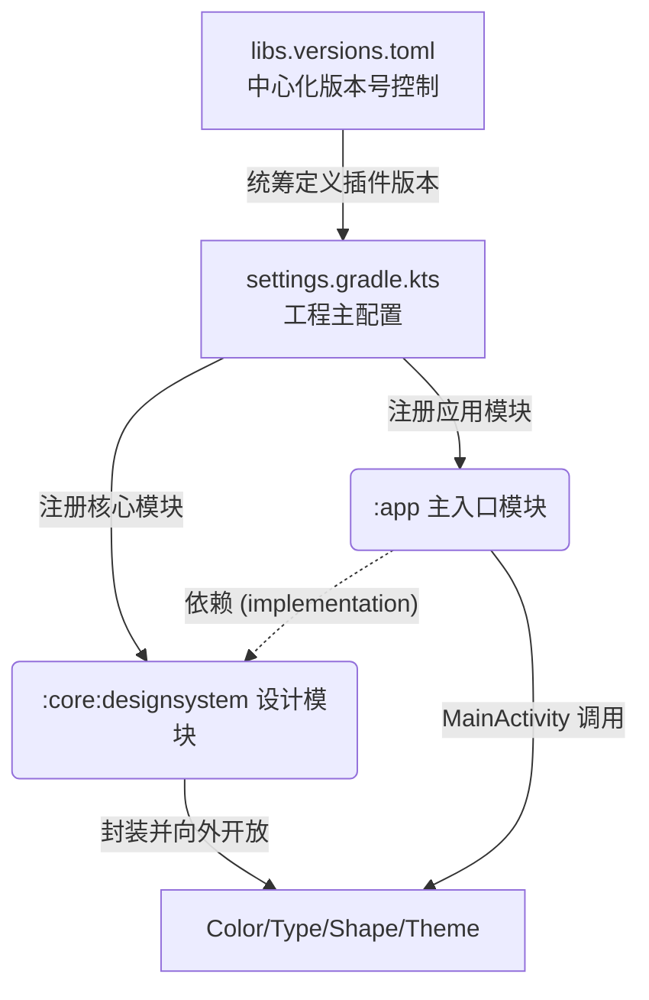

# 第一阶段 (Phase 1)：从零搭建多模块工程与设计系统

## 1. 本阶段目标与概要说明（“我们在干嘛？”）
就像造房子一样，第一阶段我们其实并没有急着去修客厅（写具体的业务页面），而是**搭起了“结构脚手架”并确定了“装修风格”**。

在传统的简单 App 里，大家习惯把所有代码塞在一起。但作为现代的优质工程，我们现在的做法是：把代表项目特色的颜色、字体、阴影（也就是前面提到的 The Culinary Handbook 设计系统）抽离出来独立成块。以后如果整个 App 的主色调想改，或者按钮的圆角要求变大，我们**只需要并且只能**去这个“核心设计系统”文件里修改，这就是“低耦合”的具体表现。

---

## 2. 代码间的逻辑与产出表格

以下表格列出了本阶段改变的重要文件，以及它们的作用，方便你随时对标溯源：

| 所属模块 / 文件件夹 | 具体的重点文件 | 它的作用与小白理解指南 |
|---|---|---|
| **项目根目录** | `gradle/libs.versions.toml` | **依赖大本营**。你可以把它当成厨房的“材料采购清单”，所有的工具库版本（如 compose 编译器版本）都在这里统一管理。我们在这里加入了 `android-library` 插件的定义，为后续创建独立模块做准备。 |
| **项目根目录** | `settings.gradle.kts` | **工程总指挥部**。它声明了这个App是由哪几个部分（楼层）组成的。我们在里面新增了 `include(":core:designsystem")`，相当于我们扩建了一个用来存图纸的资料库。 |
| **`:core:designsystem`** (我们新建的设计系统核心模块) | `Color.kt` | 存放了由 Stitch 提取的 The Living Heirloom 系列色值（比如 Primary 主色调、以及代表书卷纸张质感的背景色 #fbf9f5 等），杜绝在业务代码里硬编码写死颜色。 |
| | `Type.kt` | 定义所有的字体样式（比如大标题、正文文本的字号粗细），我们分配了 Serif (衬线字体) 代表手册质感大字。 |
| | `Shape.kt` | 这里收录了卡片、按钮的统一圆角规格（按照图纸给出的 lg=16dp, xl=24dp）。 |
| | `Theme.kt` | **最终的装配工厂**。这里将颜色、字体打包组合成了 `FoodAtlasTheme`。并且我们写了一个非常特别的代码 `Modifier.ambientShadow()`，这是一个全局扩展，因为这套设计有很特定的 6% 透明度偏暖色环境阴影。 |
| **`:app`** (最初的单一主模块) | `app/build.gradle.kts` | 在 dependencies 大括号里，我们加了 `implementation(project(":core:designsystem"))`。这是在告诉主工程：“你要买家具，去仓库 `:core:designsystem` 调货”。 |
| | `MainActivity.kt` | App 启动时的第一个画面。在这里，我们将原版自动生成的默认主题替换为了我们纯手写配置的 `FoodAtlasTheme`。 |

---

## 3. 模块架构图解

如果觉得文字太干，我们可以用下方这张组件依赖结构图来理解。箭头代表了“**谁需要谁提供功能**”。

1. `:app` 负责展示，但它本身没有造轮子的能力。
2. `:core:designsystem` 只负责提供颜色、阴影规则，它不知道具体业务是什么。
3. 这种分工就叫做**各司其职（高内聚，低耦合）**。

---

## 4. 如何进行验证与测试？
现在的底层基础设施代码已全部写完，并在后台进行一次试编译。你可以在你本地的机器上进行以下几个简单的检查动作来宣告阶段胜利：

1. **打开并同步工程**：在 Android Studio (AS) 中打开 `c:\Users\a3129\Desktop\AndroidStudy\FoodAtlas` 文件夹，点击顶部的那只**大象图标 (Sync Project with Gradle Files)**，让编辑器将刚才所有改变的代码建立索引。
2. **预览界面**：打开 `app/src/main/java/com/example/foodatlas/MainActivity.kt` 文件。在它代码窗口右上方，点击 `Split`（拆分视图）。
3. **成功标志**：如果 AS 经过几十秒后，在右侧渲染出了白底黑字（带状态栏效果）且没有红色的构建报错，证明我们的 `FoodAtlasTheme` 应用完全成功，且新模块间的桥梁全面畅通！此外，如果你看到左边的项目列表中，以前那个 `com/example/foodatlas/ui` 被我删除了并没有导致报错崩溃，这也证明旧主题已经被彻底替换。

**如果测试无报错，我们即可开启 Stage 2：完成具体的页面布局和静态组件 (如瀑布流主画面) 的代码编写了！**
