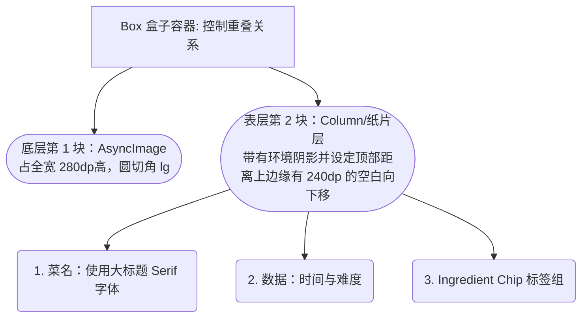

# 第二阶段 (Phase 2)：首页瀑布流与设计组件渲染

## 1. 我们在这一阶段做了什么？（白话版概要）
经过了第一阶段“搭架子”，现在我们“开始做软装了”。我们重点搭建了我们的**首页画面 (Home Screen)**，包括滑动页面、美食的图片卡片以及顶部的导航条。
由于我们是一款有高级纸质质感（The Living Heirloom）的 App，我们引入了 `Coil` 库专门用于丝滑加载远端大图。并且，我们的美食信息卡片（RecipeCard）没有使用普通的线框框起来，而是采用了经典的**“纸片错位叠加”（Paper Overlay Effect）**，即图片部分盖在前面，底部的文字介绍像一张纸片从图下面错位垫起来。

---

## 2. 成果结构表（代码功能地图）

本次所有的干货代码，都集中在我们在本项目新建的第三层楼：`:feature:home` 模块里。

| 区域文件 | 它负责的具体功能和知识点 |
|---|---|
| **`/gradle/libs.versions.toml`** | 我们引入了 `coil = "2.7.0"`，因为 Compose 原生并不支持直接加载网络图片，依靠此库来专门应对图片加载。 |
| **`app/src/main/AndroidManifest.xml`** | 必须加了这样一行 `android.permission.INTERNET`，不给权限就没办法向外请求图片。 |
| **`HomeUiState.kt`** | **大脑层**。我们目前在这里“生造”了一些假数据（FakeData）用于你这次预览：几个好吃的食谱、配图和 Tags。 以后如果我们接了真实的网络 API，真数据只需在这里替换，所有的界面不需要任何改动！ |
| **`IngredientChip.kt`** | **标签零件**。即每个食谱底下标识 “Gluten-Free” 这种小标签组件。 |
| **`RecipeCard.kt`** | **卡片零件**。由一张占 280dp 高的大图和叠加在底部 240dp 高度位置的面包屑白色背景构成，并套用了第一阶段做的 `ambientShadow` 专属阴影修饰符。 |
| **`HomeScreen.kt`** | **全屏总装工厂**。用 `LazyColumn` (瀑布列表) 把所有菜品连在一起。并且它的头部写了一个带有玻璃质感（Glassmorphism）高斯模糊 `blur(20.dp)` 的 TopBar。 |
| **`app/.../MainActivity.kt`** | 我们将最初的 `Greeting` 替换成了 `HomeScreen()`，一打开直接显示首页！ |

---

## 3. UI 堆叠原理解析 (用立体图让你理解 Compose)
当我们设计复杂的叠加视图时（比如背景有大图，大图下有纸片垫着并带阴影），可以用这张层级关系图来理解代码 `RecipeCard` 底下 `Box` 是怎么工作的：

因为 280dp（图底） > 240dp（字上缘），这就导致：**白色纸片层的上半部分会往上盖在图片的下边！** 从而形成纸张错位的高级感设计。

---

## 4. 如何进行验证测试？
现在的假数据与首页界面已经写完并且编译成功了。

1. **同步项目**：切回你的 Android Studio，点一下大象图标 (Sync) 确保没有漏依赖。
2. **预览或者运行（推荐）**：由于此次包含了网络图片功能 (`AsyncImage`)，在右侧的静态 Compose Preview 中，图片默认是加载不出的（会显示空白框）。
   👉 **所以请点击顶部的运行按钮 (Run 'app')**，将它真机或虚拟机跑到你的手机上！
3. **你应当会看到：**
   - 一个带毛玻璃效果的顶部状态栏显示 "The Culinary Handbook"。
   - 往下滚有一个瀑布流，分别是酸面包、番茄汤、披萨和牛排的高清图。
   - 图片底部被带有淡淡高级阴影的白色卡片自然叠加。

如果一切顺利而且被这种设计理念惊艳到了，随时告诉我进入真正的数据交互/详细页阶段！
